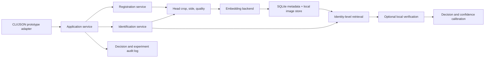

# Turtle Registration and Open-Set Re-Identification Design

Date: 2026-08-13  
Status: Approved direction; detailed design checkpoint  
Project: PCV sea-turtle individual identification

## 1. Objective

Build an offline, frontend-independent prototype engine that lets a researcher:

1. register a verified turtle from one or more photographs;
2. submit a later sighting;
3. review the five most likely registered turtles with visual evidence;
4. confirm a match, reject all candidates, or register a new turtle; and
5. measure whether the system reaches at least 85% Rank-1 accuracy on an honest, time-aware known-turtle test.

The prototype must not force an unknown turtle into an existing identity. It is a decision-support engine, not an autonomous authority. A separate frontend already exists and will consume the validated prototype contract in a later integration phase.

## 2. Scope

### In scope

- Offline macOS prototype with a framework-independent Python API.
- CLI/JSON demonstration harness and generated top-five contact sheet for validation before frontend integration.
- Local SQLite registry and local image storage.
- Registration of turtles with verified identity and encounter metadata.
- Multiple reference photographs per identity and per facial side.
- Head detection/cropping, image-quality checks, embedding extraction, retrieval, and optional local verification.
- Top-five candidate review with source photographs and evidence.
- Explicit `match`, `needs review`, and `new/unknown turtle` outcomes.
- Frozen MegaDescriptor baseline.
- Comparable experiments for multi-photo aggregation, ArcFace fine-tuning, and a dedicated turtle embedding model.
- Experimental head and front-flipper modalities, evaluated separately before any score fusion.
- Time-aware closed-set and open-set evaluation.
- A final Notion report containing method, data lineage, results, limitations, and reproducible commands.

### Out of scope for the first release

- Rebuilding or replacing the existing frontend.
- Cloud hosting, accounts, or multi-user synchronization.
- Fully automatic permanent identity assignment.
- A guaranteed 85% result before Olive Ridley repeat-sighting data exists.
- Treating unverified internet photographs as identity-labelled Olive Ridley records.
- Replacing human conservation expertise.

## 3. Existing Evidence and Constraints

- Frozen MegaDescriptor-L provides a strong animal Re-ID baseline, but its 98.64% result on SeaTurtleIDHeads is not sufficient evidence for field Olive Ridley performance.
- The existing project shows that head scale within the frame is a dominant factor: distant Zakynthos images improve dramatically after head crop.
- The Zakynthos-trained YOLO head detector is a useful baseline, but cross-species and cross-location performance must be measured.
- XFeat can improve a weak global ranking but damages an already strong Stage 1. It must be conditional and independently evaluated.
- Left and right facial profiles remain separate search partitions unless a later experiment proves a cross-side method.
- All reported comparisons use identical queries and paired statistics. Random image splits are prohibited for final claims.

## 4. User Workflow

### 4.1 Register turtle

1. Researcher creates or selects a verified Turtle ID.
2. Researcher enters species, encounter date/time, location, observer, tag ID, and notes.
3. Researcher uploads one or more photographs.
4. System detects the selected body region (head or front flipper), estimates or requests side, and computes quality warnings.
5. Researcher accepts/adjusts the crop and confirms body region and side.
6. System stores originals, crops, quality data, embeddings, and provenance.

Registration accepts a single usable photograph but recommends at least three varied photographs per side. The UI must display registry completeness by side.

### 4.2 Identify later sighting

1. Researcher uploads a new photograph and encounter metadata.
2. System detects/crops the selected body region and applies the same preprocessing contract used during registration.
3. System searches only compatible reference profiles, normally same species and same side.
4. System aggregates evidence across all reference photographs belonging to each identity.
5. System displays up to five identity candidates with gallery photos, query crop, similarity evidence, quality warnings, and rank.
6. Researcher chooses `confirm match`, `none match`, or `needs later review`.
7. Confirmed outcomes become auditable encounter records; they do not silently retrain the model.

### 4.3 Candidate confidence

Raw cosine similarity and local-inlier scores are not percentages. Until calibration succeeds, the prototype output exposes evidence labels for the frontend:

- High evidence
- Review required
- Low evidence

After calibration on held-out chronological data, the UI may show `estimated match confidence`, with a visible calibration version. Candidate values do not need to sum to 100%, because each candidate is an independent match hypothesis. Overall benchmark accuracy remains a separate metric.

## 5. Architecture

### 5.1 Components

- `registry`: identities, encounters, photos, crops, embeddings, and confirmations.
- `preprocessing`: deterministic head/flipper crop, body-region and side handling, and quality measurements.
- `embedding`: swappable frozen MegaDescriptor and trained alternatives behind one interface.
- `retrieval`: image-to-image scores followed by identity-level aggregation.
- `verification`: optional XFeat/geometric evidence for uncertain top candidates only.
- `calibration`: maps held-out evidence features to probability-like confidence and open-set thresholds.
- `evaluation`: locked chronological splits, metrics, paired comparisons, and result manifests.
- `prototype`: CLI/JSON contract, generated top-five contact sheet, audit inspection, and model/result status for frontend integration.

### 5.2 Technology

- Python 3.10-compatible ML/runtime code.
- SQLite for metadata; image and embedding artifacts stored under an application data directory with paths in SQLite.
- PyTorch/timm for MegaDescriptor and fine-tuning experiments.
- Ultralytics YOLO for head detection baseline.
- OpenCV/XFeat for optional local verification.
- NumPy/SciPy/scikit-learn for evaluation and calibration.
- Typer or argparse for the local CLI; JSON-serializable dataclasses define the future frontend contract.

The core services must not import any frontend framework. The same engine must run in tests, experiments, the prototype harness, and the later frontend adapter.

## 6. Data Model

### Turtle

- stable internal UUID
- human-readable Turtle ID/name
- species
- external tag ID, optional
- status and notes
- created/updated timestamps

### Encounter

- UUID and Turtle UUID, nullable until reviewed
- date/time, location, observer, source, and notes
- outcome provenance: manual registration, confirmed candidate, unknown, or pending

### Photo

- UUID and Encounter UUID
- original path and immutable checksum
- body region: head or front_flipper
- side: left, right, front/unknown
- detector/crop coordinates and detector version
- blur, brightness, head-area fraction, resolution, and warnings
- inclusion state and exclusion reason

### Embedding

- Photo UUID
- model name, exact weights hash, preprocessing version, vector dimension
- normalized vector artifact path

### Identification decision

- query Photo UUID
- ranked candidate identities and component scores
- threshold/calibrator versions
- operator outcome and timestamp
- optional correction that preserves the original decision

## 7. Model Strategy

### Baseline A: Frozen MegaDescriptor

- MegaDescriptor-L-384 embeddings.
- Same-side cosine retrieval.
- Identity score derived from the best reference image and top-k/centroid aggregation variants.
- No fine-tuning.

### Baseline B: Frozen MegaDescriptor plus conditional XFeat

- Rerank only if the global stage is uncertain according to validation rules.
- Compare Rank-1, Rank-5, latency, and failure rate against Baseline A.
- Never enable solely because it improves one dataset.

### Candidate C: MegaDescriptor initialized, ArcFace fine-tuned

- Start from MegaDescriptor weights.
- Train on identity-labelled head crops using ArcFace loss.
- Dataset-balanced sampling prevents a large species/dataset from dominating.
- Freeze-then-unfreeze schedule and low learning rate reduce catastrophic forgetting.
- Training identities may include public turtle species, but the final Olive Ridley test identities remain unseen.

### Candidate D: Dedicated ArcFace embedding backbone

- Train a smaller backbone with the same data and split contract.
- Compare accuracy, robustness, latency, and artifact size.
- Adopt only if it improves the predeclared evaluation metrics.

### Experimental modality E: Front-flipper matching

- Treat front-flipper crops as a separate modality with separate embeddings, thresholds, metrics, and missing-data behavior.
- Begin with frozen MegaDescriptor and local-feature baselines on labelled flipper crops.
- Do not compare a query head against a registered flipper.
- Test head-only, flipper-only, and paired head+flipper conditions on the identical identities and encounters.
- Permit fusion only if validation shows a statistically supported gain without worsening open-set false accepts.
- Keep head-only identification fully functional because field sightings often lack a usable flipper view.

### Detector experiments

1. Current Zakynthos YOLO baseline.
2. Cross-dataset detector trained from Zakynthos boxes plus SeaTurtleID2022 head masks/boxes.
3. Few-shot Olive Ridley adaptation when verified annotations become available.

The final detector test includes unseen locations/species and separately reports misses. Failed detections remain in end-to-end evaluation.

## 8. Dataset Policy

Each photograph receives one of four roles:

- detector training/validation/test;
- Re-ID training;
- Re-ID calibration/validation; or
- locked final test.

No image, near-duplicate encounter, or identity crosses prohibited boundaries. Splits are encounter/time aware. Dataset hashes and manifests record exact membership.

Internet Olive Ridley images without repeat-sighting identity labels may support species/head detection and robustness testing. They cannot be used as Re-ID identity ground truth.

The final 85% claim requires verified Olive Ridley identities with earlier registration encounters and later query encounters. If that dataset is unavailable, the system may be completed, but the target remains `not yet measurable` rather than passed.

## 9. Evaluation Protocol

### 9.1 Closed-set known-turtle test

- Gallery: accepted registration photos from earlier encounters.
- Query: later encounters of the same registered identities.
- Metrics: Rank-1, Rank-5, mAP, side breakdown, species breakdown, detector success, and end-to-end latency.
- Primary success gate: Rank-1 at least 85% with sample count and 95% confidence interval reported.
- Human-review gate: Rank-5 at least 95%, if supported by sufficient sample size.

### 9.2 Open-set test

- Hold out complete identities as unknown queries.
- Report true-unknown rejection, false-accept rate, false-reject rate, AUROC, and operating threshold.
- Initial safety gate: false-accept rate at or below 5% at the selected threshold. Unknown-rejection recall is reported rather than hidden behind overall accuracy.

### 9.3 Robustness slices

- facial side;
- body region (head versus front flipper);
- species;
- head area in frame;
- blur;
- brightness;
- crop/detector success;
- number of registration photos;
- time since registration;
- source location/camera.

### 9.4 Statistical comparison

- McNemar exact test for paired Rank-1 outcomes.
- Paired bootstrap confidence interval for mAP and accuracy differences.
- Confidence calibration measured with reliability plots, expected calibration error, and Brier score.
- Thresholds and model choice fixed on validation data before final test execution.

## 10. Testing

### Unit tests

- database constraints and migrations;
- deterministic preprocessing and checksums;
- same-side filtering;
- identity-level score aggregation;
- no-match threshold logic;
- top-five ordering;
- confidence-label rendering;
- model/preprocessing version invalidation.

### Integration tests

- register a turtle, close/reopen the app, and retrieve it;
- identify a later photo and display correct evidence;
- reject all five candidates and register a new identity;
- correct a mistaken confirmation without losing audit history;
- missing detector output uses an explicit fallback/warning;
- prototype engine decisions equal experiment engine decisions.
- JSON output round-trips without losing candidate ranks, evidence, warnings, or provenance.
- generated top-five contact sheet contains the query crop and correct registered reference for each candidate.

### Regression and leakage tests

- reproduce locked existing baseline results;
- verify no encounter or identity leakage in manifests;
- mutation tests prove protocol tests can fail;
- final metrics are regenerated from result artifacts, never typed into UI or reports.

### Human usability test

At least three people not involved in implementation attempt registration and later identification without coaching. Record completion, errors, hesitation points, and interpretation of confidence labels.

## 11. Delivery Phases

### Phase 0: Reproducibility recovery

- Restore authoritative source from Git history without overwriting unrelated user files.
- Restore dependency manifest and project instructions.
- Run existing protocol/UI/equivalence tests and inventory result artifacts.

### Phase 1: Registry and deterministic engine

- Implement schema, repository layer, image artifact layout, registration engine, embedding backend interface, and tests.

### Phase 2: Human-centered prototype contract

- Implement registration, identification, top-five JSON/contact-sheet review, new-turtle flow, history, corrections, and quality warnings.
- Freeze the frontend integration contract without modifying the existing frontend.

### Phase 3: Honest baseline evaluation

- Build manifests and evaluate frozen MegaDescriptor, multi-photo aggregation, current YOLO, and conditional XFeat.

### Phase 4: Model improvement experiments

- Train/evaluate cross-dataset detector.
- Fine-tune MegaDescriptor with ArcFace.
- Train/evaluate smaller dedicated ArcFace model.
- Evaluate front-flipper retrieval separately and test head+flipper fusion only after both unimodal baselines are valid.
- Calibrate unknown thresholds and confidence only on held-out validation data.

### Phase 5: Real Olive Ridley test and report

- Import verified Olive Ridley repeat sightings when available.
- Lock final time-aware split, run once, and publish all positive and negative results.
- Update the Notion report with reproducible commands, artifacts, limitations, and decision.

## 12. Acceptance Criteria

- Prototype engine and CLI work offline on the target Mac.
- User can register an identity with multiple photos and metadata.
- User can identify a later photo and receive up to five candidates as JSON plus a generated visual contact sheet.
- User can select none of the candidates and register a new turtle.
- Left/right handling and quality warnings are explicit.
- Head/flipper routing is explicit; cross-region comparisons are prohibited.
- All decisions retain provenance and are correctable without deleting history.
- No raw similarity is presented as an accuracy percentage.
- Numeric confidence is displayed only after held-out calibration passes documented checks.
- Frozen MegaDescriptor remains a reproducible baseline.
- Every trained alternative is tested on the same locked query set.
- Flipper-only and any fused condition are reported separately from the head-only primary result.
- Final report includes sample counts, Rank-1, Rank-5, mAP, open-set metrics, confidence intervals, latency, and robustness slices.
- The project claims at least 85% only if the locked time-aware Olive Ridley known-turtle test proves it; otherwise it reports the measured result and the remaining data gap.

## 13. Risks and Mitigations

- **Insufficient Olive Ridley repeat sightings:** ship the data-collection application and label the accuracy target not yet measurable.
- **Public-data leakage into MegaDescriptor:** audit known pretraining sources and rely on held-out local Olive Ridley identities for the final claim.
- **Wrong human registrations:** require provenance, confirmations, merge/correction workflow, and immutable audit history.
- **Overfitting fine-tuning datasets:** identity-disjoint/time-aware splits, dataset balancing, early stopping, and frozen final test.
- **Misleading confidence:** delay percentages until calibration and always preserve `none match`.
- **Detector domain shift:** include detector failure in end-to-end metrics and collect a small labelled Olive Ridley adaptation set.
- **Compute limits:** use resumable training, cached embeddings, and a smaller candidate model.

## 14. Sources

- MegaDescriptor model card: https://huggingface.co/BVRA/MegaDescriptor-L-384
- WildlifeDatasets paper: https://arxiv.org/abs/2311.09118
- SeaTurtleID2022: https://openaccess.thecvf.com/content/WACV2024/papers/Adam_SeaTurtleID2022_A_Long-Span_Dataset_for_Reliable_Sea_Turtle_Re-Identification_WACV_2024_paper.pdf
- ArcFace: https://openaccess.thecvf.com/content_CVPR_2019/papers/Deng_ArcFace_Additive_Angular_Margin_Loss_for_Deep_Face_Recognition_CVPR_2019_paper.pdf
- XFeat: https://openaccess.thecvf.com/content/CVPR2024/papers/Potje_XFeat_Accelerated_Features_for_Lightweight_Image_Matching_CVPR_2024_paper.pdf
- Olive Ridley Project photo-ID protocol: https://oliveridleyproject.org/research/biogeography/sea-turtle-photo-id/
- Sea-turtle flipper-scale photo-ID study: https://www.sciencedirect.com/science/article/pii/S0022098118301400
